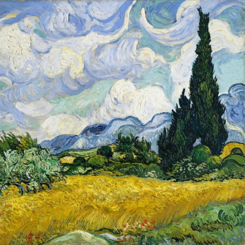
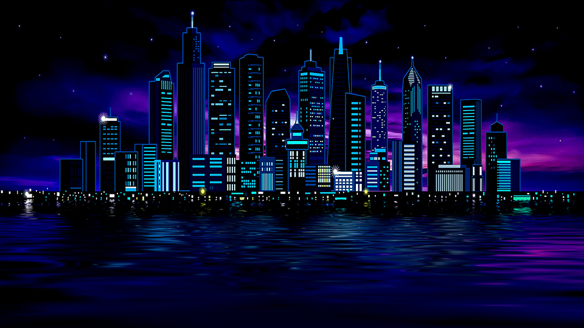
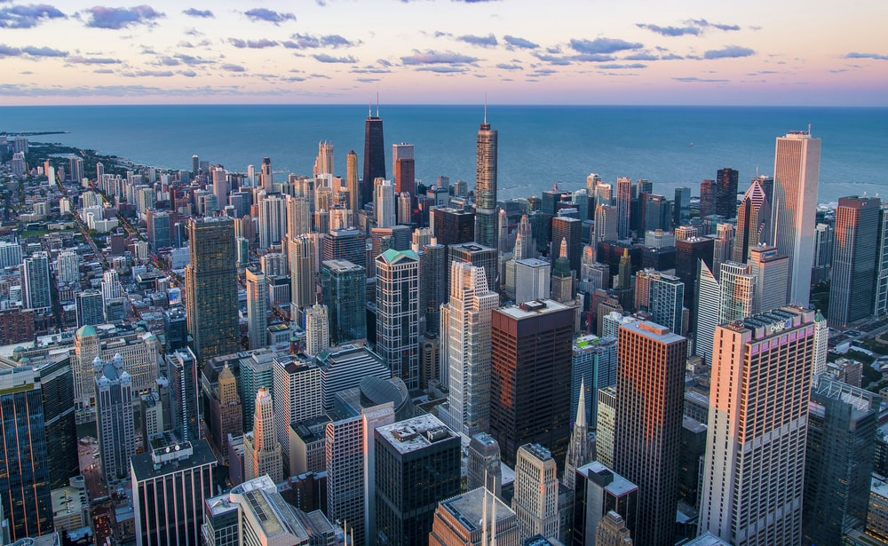
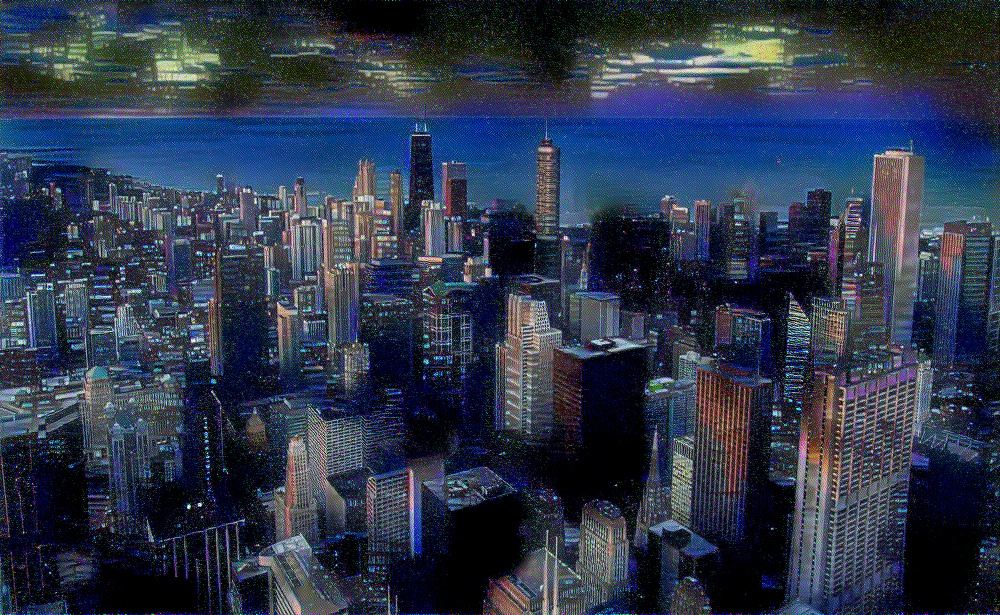
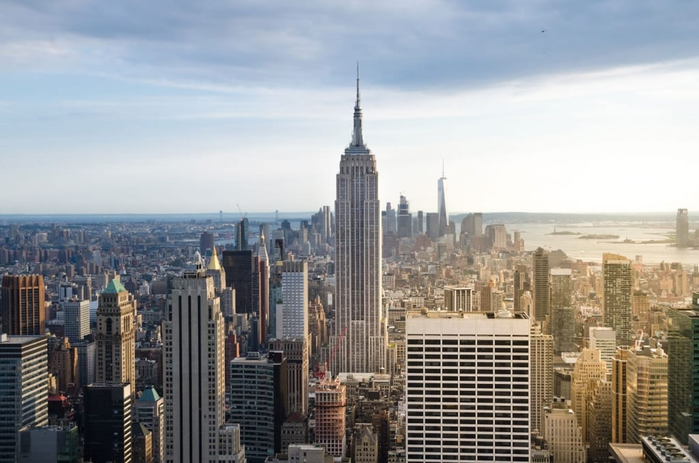
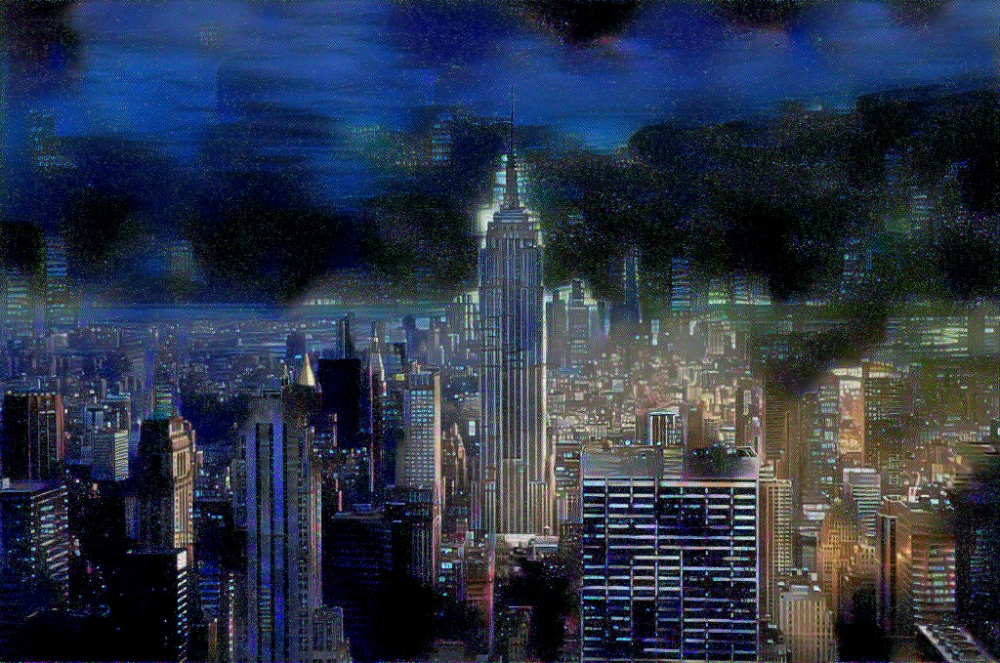

# Neural Style Tansfer(NST) with Pytorch
## Index
- [Usage](https://github.com/abhilashreddyy/Neural-Style-Transfer#usage)
- [Theory](https://github.com/abhilashreddyy/Neural-Style-Transfer#theory)
  - [How NST works ?](https://github.com/abhilashreddyy/Neural-Style-Transfer#how-neural-style-transfer-nst-works-)
    - [Loss Calculation](https://github.com/abhilashreddyy/Neural-Style-Transfer#loss-calculation)
- [Experiments with different Parameters]()
- [NST for Data Augmentation](https://github.com/abhilashreddyy/Neural-Style-Transfer#nst-for-data-augmentation)
- [How Back Propagation work in NST](https://github.com/abhilashreddyy/Neural-Style-Transfer#how-back-propogation-work-in-nst)
- [Credits](https://github.com/abhilashreddyy/Neural-Style-Transfer#credits)

# Usage
Config file contains all the parameters you can tune
- __MODEL__
  - There are three options
    - "VGG19"
      - Generates good results but heavy model
    - "VGG16"
      - Generates average results but comparitively lighter model than VGG19
    - "MobileNet"
      - Dont use this. It was just used for experimentation
      - Maybe because of depthwise seperable convolution the generated images clarity is poor
- __CONTENT_IMAGE_PTH__
  - absolute or realtive path of content image
- __STYLE_IMAGE_PTH__ 
  - absolute or realtive path of style image
- __RESHAPE_CONTENT_IMAGE__
  - Desired height of new content image
    - If there are too many pixels GPU memory may get exhausted and could take lot of time to train. In such cases reduce the image resolution
  - __range__ : 1 to {preferably number smaller than content image height}
  - __Width will be automatically adjusted according to aspect ratio__
- __RESHAPE_STYLE_IMAGE__
  - Desired height of new style image
    - If the style image have huge resolution then CNN will not be able to capture the patterns in image
    - In such cases try to reduce the resolution of style image so that patterns in the style image are easily captured 
    - Also, If there are too many pixels GPU memory may get exhausted and could take lot of time to train. In such cases reduce the image resolution
    - __range__ : 1 to {preferably number smaller than style image height}
  - __Width will be automatically adjusted according to aspect ratio__
- __OUTPUT_PATH__
  - absolute or realtive path of output folder
- __EPOCS__
  - number of epocs to train the generated image
  - with LEARNING RATE 1e1 sweet spot is somewhere around 1500-2000
  - __range__ : 0 to +inf
- __LEARNING_RATE__
  - Learning rate of generated image. In other words speed with which generated image is updated
  - __range__ : 0 to +inf
- __CONTENT_WEIGHT__
  - weight of content component of loss
  - __range__ : 0 to +inf
- __STYLE_WEIGHT__
  - weight of style component of loss
  - for VGG19 good content and style weight is around (1e6,1e3-2e3)
  - __range__ : 0 to +inf
- __SAVE_FREQ__
  - Saving frequency of the output image in terms of epocs
  - If set to 10 output image will be saved after every 10 epocs
  - __range__ : 1 to <number smaller than EPOCS>

__NOTE__ : Dont worry about difference in size of content or style image. Any size of image works

# Theory
Now we are in an era where neural networks generate art. This reository is an implementation of the paper [Neural Style Transfer Paper](https://arxiv.org/abs/1508.06576) by Leon A. Gatys, Alexander S. Ecker, Matthias Bethge. 

The paper presents and algorithm for combining the content of  one image  with the style of another image using Convolutional Neural Networks. Here is and example of combining my content image with and style image made of black and white texture.

|   Styled image | Normal Image|
| --- | ----------- |
|  |  
__After Style Transfer__

## Applying syle using various styling images

Consider the example applying various styles on content image related to nature 

|__Style Image__| __Final Result__|
| --- | ----------- |
|  |  
|  |  

Loss Function

Loss is calculated using both content image and style image

## How Neural Style Transfer (NST) works ?

NST employs a pretrained convolution neural network (CNN) to transfer styles from a given image to another. This is done by defining a loss function that tries to minimise the differences between a content image, a style image and a generated image so that the texture of style image blend with the content image generating beautiful images.

In the above image you can observe how style loss is calculated form feature maps of multiple layers and the content loss is calculated form a single set of featrure maps

Style loss is calculated over multiple layers so that various texture sizes are considered while adding style to the target image. We will explain this in detail.

Finally loss is calculated between style image, target image and content image, target image. This loss is added in a weighted fasion which determines how much style is added to a given image.

## Loss Calculation
There are two components of loss as described above
1. Content Loss ()
2. Style Loss ()

Therefore total loss is 

%20=%20\alpha%20L_{Content}(C,G)+\beta%20L_{Style}(S,G))

Where S is style image, C is content image, G is generated Image and  is weight of Content Loss and  is weight of style loss. We will see how these weight affect the target image (output).

Before going further lets understand how feature maps are generated.

### Generate Feature Maps

In the above image we can observe how a single convolution happend. The final cube which is at far right of the image is called __feature maps__/__activation maps__ where there 64 feature maps each of shape 224*224.

### 1. Content Loss ()

Content loss represent the difference in the content of the content image and generated image. At a given layer of CNN feature maps are generated for both content image and target image. Then we calculate mean square error loss between each corresponding feature maps. In this repository we mainly use VGG19 where we use 2nd convolutions feature maps for calculating content loss.

%20=\frac%20{1}{2}\sum%20(C_{i,j,k}^{l}-G_{i,j,k}^{l})^2)

Hence at a given layer of CNN  is feature map number  is the index of the individual feature. According to above diagram _i=224, j=224,k = 64_

### 2. Style Loss () 

Style loss mesasures the differnece between style of generated image and style image. It help in maintaining the texture patterns from the style image into generated image.

Gram matrix(GM) is generated from feature maps which used to generate style loss. Gram matrix is a correlation matrix among different feature map channels at a givnen layer.

In the above image correlation is calculated among each feature map at a given layer to generate gram matrix(GM). Therefore if the shape of the feature map of syle image is 4*4*5 then the shape of gram matrix is5*5$. Because correlation is calculate across each feature map of shape 4*4 with all other feature maps resulting in 5*5 combinations

%20=%20\sum_{ij}(GM[l](S)_{ij}-GM[l](G)_{ij})^2)

Here _{ij}](https://latex.codecogs.com/svg.latex?\Large&space;GM[l](S)_{ij}) means number at position i,j in gram matrix of layer l in CNN when style image is used as input.

Style loss is calculated from multiple layers as shown above. different layers in CNN extract different level of patterns in image (eg : initial layers extract edges then colours and textures, then larger patterns). Hence considering different layers of CNN for style loss will help in adding various levels (edges, colours, small patterns, large patterns) of texture/style to the generated image.

Total Style loss

%20=%20\sum_{l=0}^{L}L_{GM}(S,G,l))

where L represent the number of layers considered for style loss

## Why gram matrix work ?
Gram Matrix is correlation matrix between feature maps. What this basically means is given N feature maps. If a given feature map is hugely activated and when a correlation is calculated with anther feature map which is also activated then the corresponding value of gram matrix will be high. As a result it forces the generated images gram matrix to have similar style patterns.

## Experiments with different Parameters

Changing the weight of style loss and content loss will change the predominant feature of the image. If the content weight is larger then content will be dominant feature of generated and vice versa. Below images are generated from different weights of styles

|Content Image| Style Image|
| --- | ----------- |
|||
|style weight = 2e2 , content weight = 1e6| style weight = 1e3 , content weight = 1e6|
| --- | ----------- |
|||
|style weight = 3e3 , content weight = 1e6| style weight = 7e3 , content weight = 1e6|
| --- | ----------- |
|||
|style weight = 1e4 , content weight = 1e6| style weight = 5e4 , content weight = 1e6|
| --- | ----------- |
|||

## NST for data Augmentation 
NST if used properly can be very helpful in data augmentation. One good example is converting daytime of a city to night time as shown below

|style image|
| --- |
|||

|Content Image| generated_image|
| --- | ----------- |
|||
|||

Observe the converted image have the night effect of style image like lights on building walls etc.

## How back propogation work in NST
In general back propogation is used to update weights of the neural network. But in NST we sue back propagation to update the input image so that we genearte stylised image. 

Initially genearted image is filled with guassian noise. However while converting generated image to tensor we set the generated image tensor to trainable. Also all the parameters in pretrained CNN network are set to non-trainable. When we multiply the generated image with CNN generated image will become the part of network and since we set the input image to trainable, loss values start updating the generated image converting it into stylised image.

## How size of style image effect patterns in output
1. use it for data augmenttion
2. how tensor graph update image in back prop
3. why gram matrix work
4. change in style size can recognise patterns easily (how to generate good style)

## Credits
 - This implementation is inspired from [this](https://www.youtube.com/watch?v=S78LQebx6jo&list=PLBoQnSflObcmbfshq9oNs41vODgXG-608&ab_channel=TheAIEpiphany) tutorial on YouTube by [Aleksa Gordic](https://github.com/gordicaleksa)
 - Some of the images i have use for explanation are from [here](https://towardsdatascience.com/neural-style-transfer-tutorial-part-1-f5cd3315fa7f)
