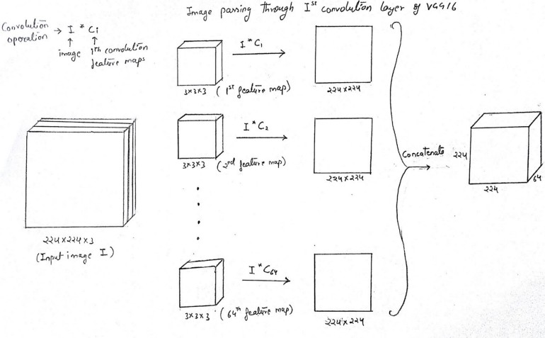
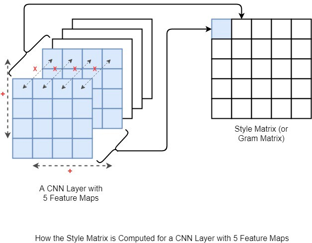

This repository is still work in progress

# Neural Style Tansfer with Pytorch

Now we are in an era where neural networks generate art. This reository is an implementation of the paper [Neural Style Transfer Paper](https://arxiv.org/abs/1508.06576) by Leon A. Gatys, Alexander S. Ecker, Matthias Bethge. 

The paper presents and algorithm for combining the content of  one image  with the style of another image using Convolutional Neural Networks. Here is and example of combining my content image with and style image made of black and white texture.

|   Style Transfer        ||
| --- | ----------- |
|  |  

## Applying syle using various styling images

Consider the example applying various styles on content image related to nature 

|__Style Image__| __Final Result__|
| --- | ----------- |
|  |  
|  |  

Loss Function

Loss is calculated using both content image and style image

## How Neural Style Transfer (NST) works ?

NST employs a pretrained convolution neural network (CNN) to transfer styles from a given image to another. This is done by defining a loss function that tries to minimise the differences between a content image, a style image and a generated image so that the texture of style image blend with the content image generating beautiful images.

In the above image you can observe how style loss is calculated form feature maps of multiple layers and the content loss is calculated form a single set of featrure maps

Style loss is calculated over multiple layers so that various texture sizes are considered while adding style to the target image. We will explain this in detail.

Finally loss is calculated between style image, target image and content image, target image. This loss is added in a weighted fasion which determines how much style is added to a given image.

## Loss Calculation
There are two components of loss as described above
1. Content Loss ($L_{content}$)
2. Style Loss ($L_{style}$)

Therefore total loss is 

$L_{Total}(S,C,G) = \alpha L_{Content}(C,G)+\beta L_{Style}(S,G)$

Where S is style image, C is content image, G is generated Image and $\alpha$ is weight of Content Loss and $\beta$ is weight of style loss. We will see how these weight affect the target image (output).

Before going further lets understand how feature maps are generated.

### Generate Feature Maps

In the above image we can observe how a single convolution happend. The final cube which is at far right of the image is called __feature maps__/__activation maps__ where there 64 feature maps each of shape 224*224.

### 1. Content Loss ($L_{content}$)

Content loss represent the difference in the content of the content image and generated image. At a given layer of CNN feature maps are generated for both content image and target image. Then we calculate mean square error loss between each corresponding feature maps. In this repository we mainly use VGG19 where we use 2nd convolutions feature maps for calculating content loss.

$L_{content}(C,G) =\frac {1}{2}\sum (C_{i,j,k}^{l}-G_{i,j,k}^{l})^2$

Hence at a given layer of CNN $n$ is feature map number $i,j,k$ is the index of the individual feature. According to above diagram $i=224, j=224,k = 64$

### 2. Style Loss ($L_{style}$) 

Style loss mesasures the differnece between style of generated image and style image. It help in maintaining the texture patterns from the style image into generated image.

Gram matrix(GM) is generated from feature maps which used to generate style loss. Gram matrix is a correlation matrix among different feature map channels at a givnen layer.

In the above image correlation is calculated among each feature map at a given layer to generate gram matrix(GM). Therefore if the shape of the feature map of syle image is $4*4*5$ then the shape of gram matrix is $5*5$. Because correlation is calculate across each feature map of shape $4*4$ with all other feature maps resulting in $5*5$ combinations

$L_{GM}(S,G,l) = \sum_{ij}(GM[l](S)_{ij}-GM[l](G)_{ij})^2$

Here $GM[l](S)_{ij}$ means number at position i,j in gram matrix of layer l in CNN when style image is used as input.

Style loss is calculated from multiple layers as shown above. different layers in CNN extract different level of patterns in image (eg : initial layers extract edges then colours and textures, then larger patterns). Hence considering different layers of CNN for style loss will help in adding various levels (edges, colours, small patterns, large patterns) of texture/style to the generated image.

Total Style loss

$L_{Style}(S,G) = \sum_{l=0}^{L}L_{GM}(S,G,l)$

where L represent the number of layers considered for style loss

## Experiment with different weights of style

Changing the weight of style loss and content loss will change the predominant feature of the image. If the content weight is larger then content will be dominant feature of generated and vice versa. Below images are generated from different weights of styles

|Content Image| Style Image|
| --- | ----------- |
|||

|style weight = 2e2 , content weight = 1e6| style weight = 1e3 , content weight = 1e6|
| --- | ----------- |
|||
|style weight = 3e3 , content weight = 1e6| style weight = 7e3 , content weight = 1e6|
| --- | ----------- |
|||
|style weight = 1e4 , content weight = 1e6| style weight = 5e4 , content weight = 1e6|
| --- | ----------- |
|||

## Things no one say to you
1. use it for data augmenttion
2. how tensor graph work in back prop
3. why gram matrix work
4. change in style size can recognise patterns easily

## Usage

## Credits
 __NOTE :__ This implementation is inspired from [this](https://www.youtube.com/watch?v=S78LQebx6jo&list=PLBoQnSflObcmbfshq9oNs41vODgXG-608&ab_channel=TheAIEpiphany) tutorial on YouTube by [Aleksa Gordic](https://github.com/gordicaleksa)

## Further References

#### [TBD] exeption handling, command line parameters
#### restructure files and save experiment images properly
#### keep which layers to use in which network as config